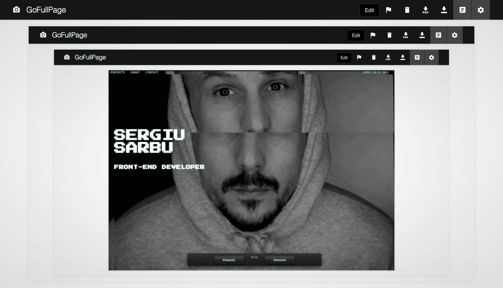
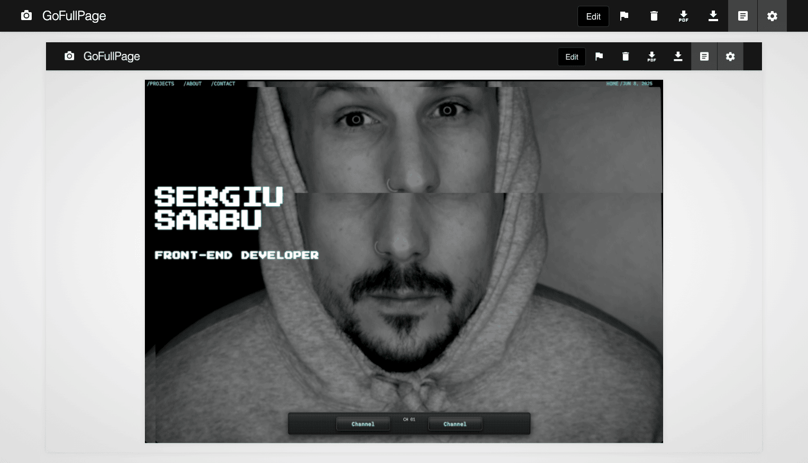
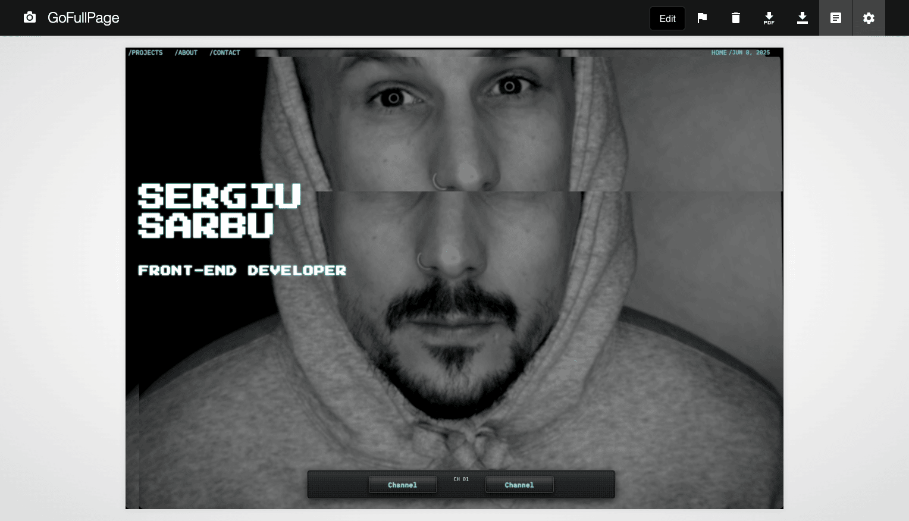
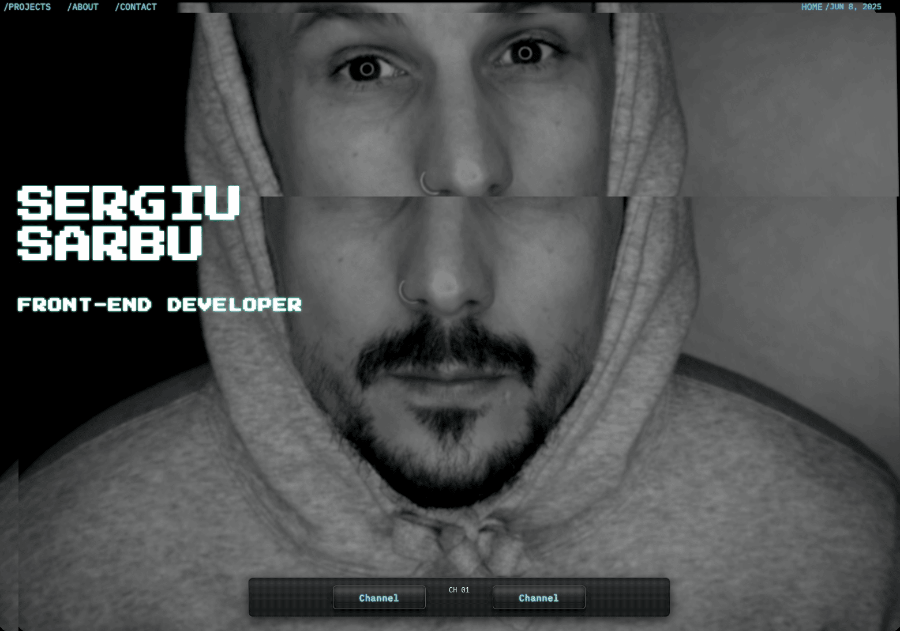
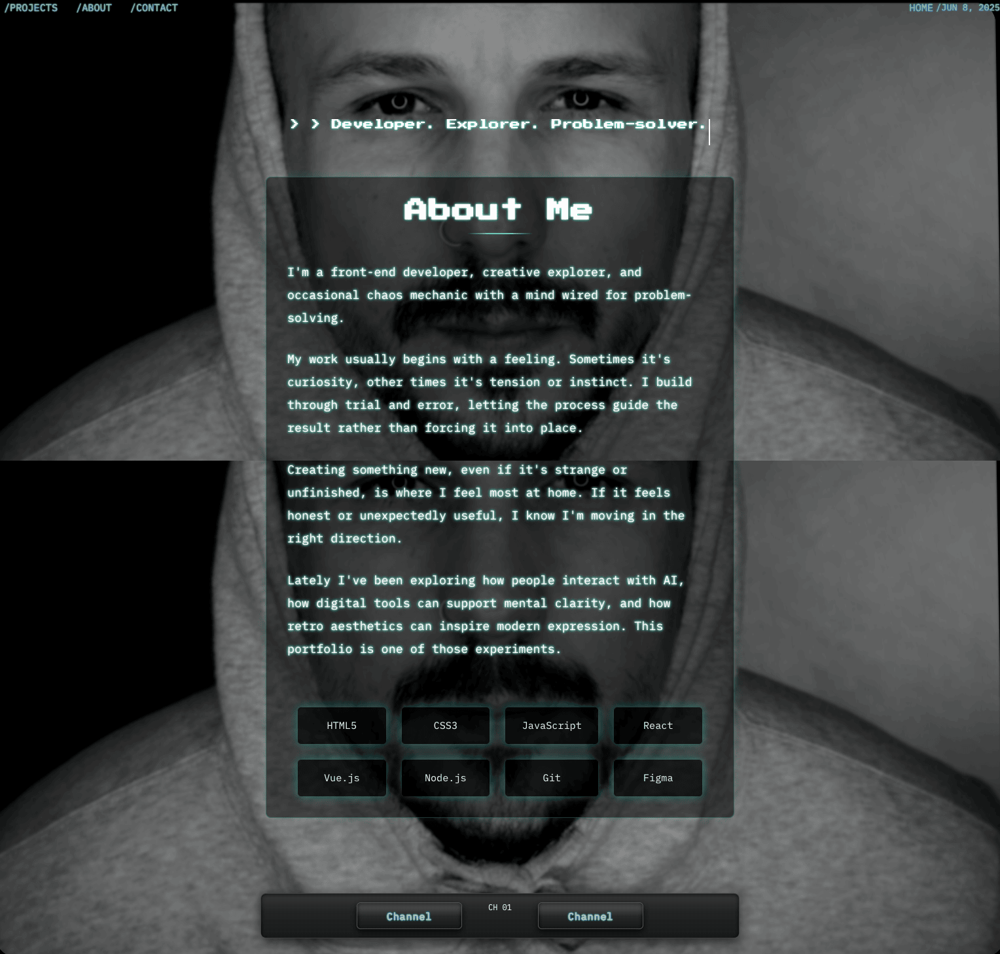
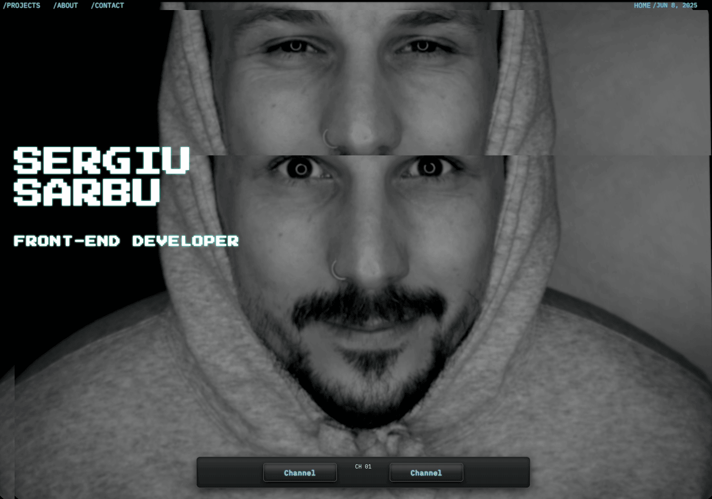
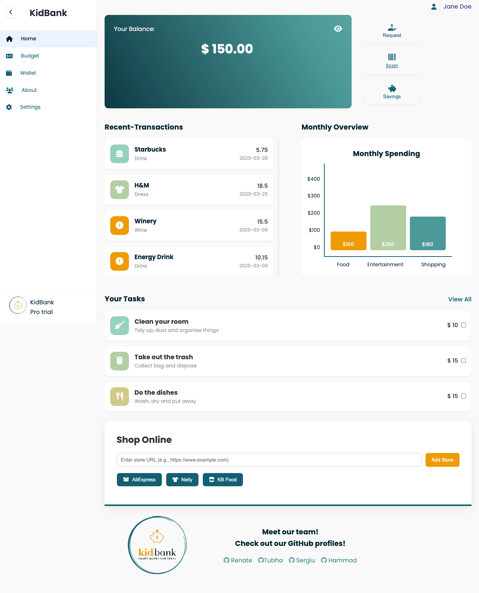
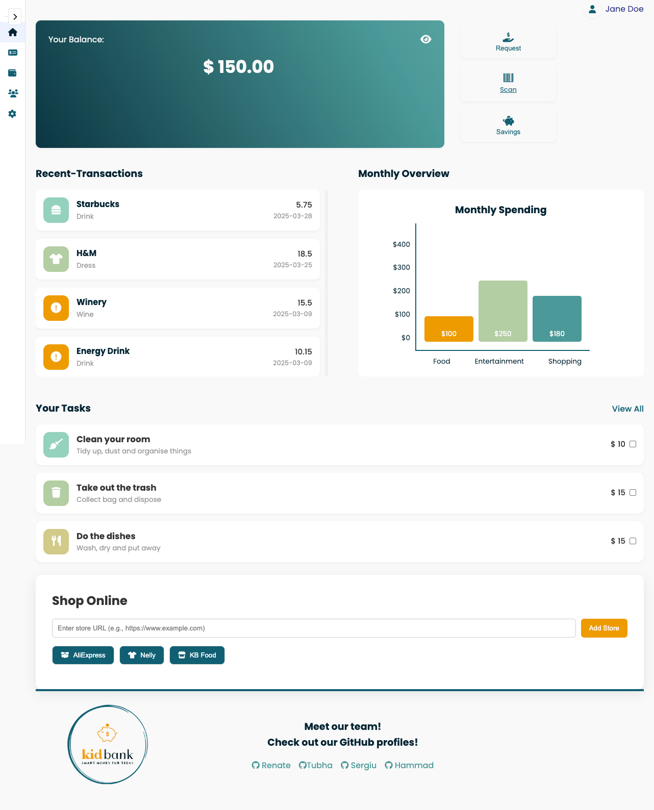
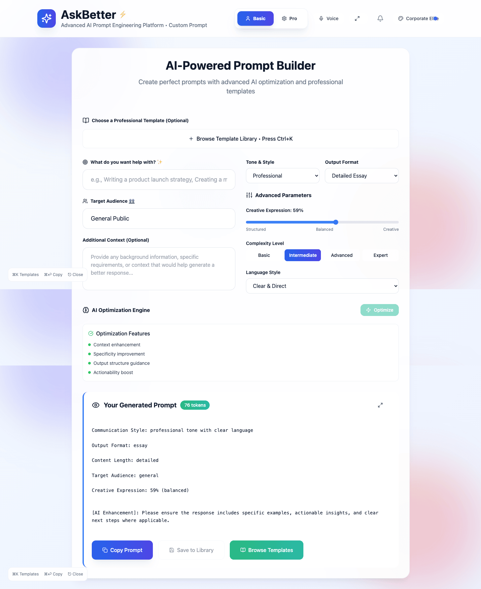
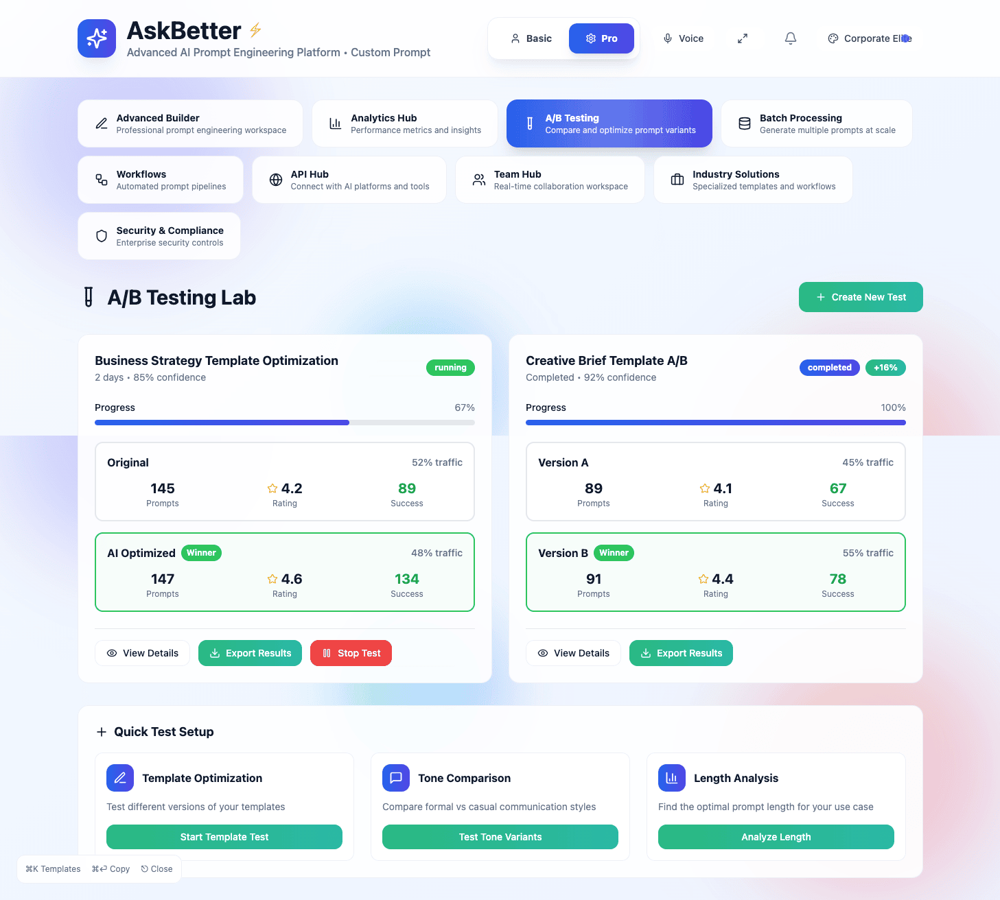

# Sergiu Sarbu — Developer Portfolio (CRT Edition)

This is my personal portfolio site built as part of the Noroff Front-End Development 1 curriculum. It showcases three core projects from my first year and is presented through a custom visual interface inspired by retro **CRT** (Cathode Ray Tube) displays — the analog screens used in old televisions and monitors.

Rather than a traditional layout, this portfolio uses a fullscreen "TV screen" background that mimics changing channels, static noise, scanlines, and flicker effects to create an immersive, nostalgic user experience.

---

## Project Purpose

The goal of this portfolio is to:

- Present three development projects using a clear, visual card layout
- Reflect my personality and problem-solving style
- Experiment with alternative user interfaces and creative theming
- Fulfill the required deliverables of the FED1 portfolio brief

---

## What Is CRT?

CRT stands for **Cathode Ray Tube**, a technology once used in old televisions and monitors, and is used here to evoke a retro-futuristic atmosphere.

---

## Technologies Used

- HTML5, CSS3, Vanilla JavaScript
- Vite (for fast development and bundling)
- Web APIs (e.g. `getUserMedia` for webcam access)
- Custom CSS animations (flicker, scanlines, glitch, terminal text effects)

---

## Key Features

- **Channel-based CRT interface**: User can switch channels that control the animated background (looped videos, static, webcam)
- **Live Webcam Mode**: One channel activates the user’s camera feed with retro filters
- **Project Showcase**: Each project is displayed as a card with title, description, screenshot, and links
- **About & Contact Sections**: Styled with typewriter animation, terminal layout, and responsive design
- **Fully responsive** for both desktop and mobile screens

---

## Projects Displayed

Each project card includes a short description, GitHub repo link, and a live site preview.

### 1. Square Eyes

A responsive film discovery website with semantic HTML and modular CSS.  
GitHub: [https://github.com/sergiu-sa/pro-school-react.git](https://github.com/sergiu-sa/pro-school-react.git)  
Live Site: [https://sergiu-sa.github.io/pro-school-react/](https://sergiu-sa.github.io/pro-school-react/)

### 2. Kid Bank

A prototype banking interface for teens with product scanning logic and age-check.  
GitHub: [https://github.com/sergiu-sa/kid*bank*.git](https://github.com/sergiu-sa/kid_bank_.git)  
Live Site: [https://k1dbank.netlify.app](https://k1dbank.netlify.app)

### 3. AskBetter

A tool that helps users shape better AI prompts using emotion, intent, and visual input.  
GitHub: [https://github.com/sergiu-sa/askbetter](https://github.com/sergiu-sa/askbetter)  
Live Site: [https://askbetter.netlify.app](https://askbetter.netlify.app)

---

## How to Run Locally

1.Clone the repository:

```bash
git clone https://github.com/sergiu-sa/portfolio_crt.git

```

2.Navigate to the project folder:

```bash
cd portfolio_crt
```

3.Install dependencies:

```bash
npm install
```

4.Start the development server:

```bash
npm run dev
```

5.Open the local server in your browser:

```bash
http://localhost:5173
```

---

## Folder Structure

```bash
portfolio_crt/
├── public/
│   └── assets/
│       ├── collage/          (move from src/assets/collage/)
│       ├── projects/         (move from src/assets/projects/)
│       └── retro/           (move from src/assets/retro/)
├── src/
│   ├── style/
│   ├── js/
│   └── main.js
└── index.html
```

---

## Status

The project is fully functional and deployed. Webcam functionality is supported in modern browsers only and requires permission.

---

## Author

**Sergiu Sarbu**  
Front-End Development student at Noroff School of Technology and Digital Media

GitHub: [https://github.com/sergiu-sa](https://github.com/sergiu-sa)

---

## License

This project is open source and available under the [MIT License](LICENSE).

---

## Projects Showcased

| Project     | Description                                                           | GitHub Repository                                                | Live Site                                                                     |
| ----------- | --------------------------------------------------------------------- | ---------------------------------------------------------------- | ----------------------------------------------------------------------------- |
| Square Eyes | Responsive film discovery site with clean HTML and modular CSS        | [square-eyes](https://github.com/sergiu-sa/pro-school-react.git) | [square-eyes-vite.netlify.app](https://sergiu-sa.github.io/pro-school-react/) |
| Kid Bank    | Fintech prototype for teens with barcode scanning and age-check logic | [kid-bank](https://github.com/sergiu-sa/kid_bank_.git)           | [kidbank.netlify.app](https://k1dbank.netlify.app)                            |
| AskBetter   | AI prompt design tool using emotion-driven inputs and retro UI        | [askbetter](https://github.com/sergiu-sa/askbetter)              | [askbetter.vercel.app](https://askbetter.netlify.app)                         |

---

## Screenshots

> Screenshots below show desktop views for the portfolio and projects.

### Portfolio (CRT Interface)








### Square Eyes


### Kid Bank




### AskBetter



